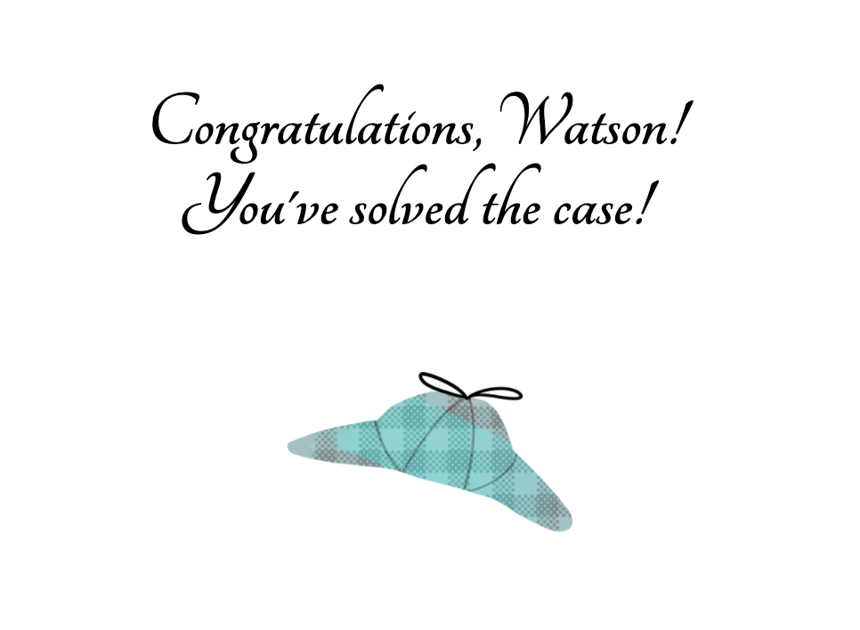
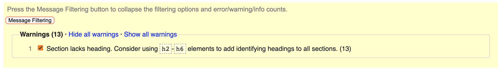
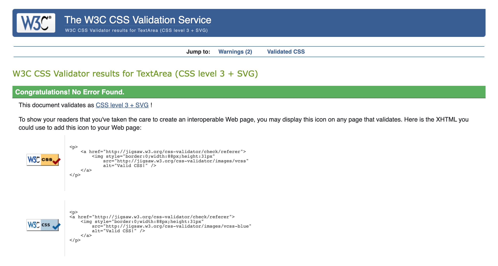

# **Sherlock Holmes & The Adventure of the Blue Carbuncle**

View the live project here: https://gabriele-andolina.github.io/sh-blue-carbuncle/

*Sherlock Holmes & The Adventure of the Blue Carbuncle* is a web adaption of one of Sir Arthur Conan Doyle's Sherlock Holmes short stories.

The goal of the website is to provide a form of entertainment that is at the same time fun and educational, allowing the users to be an active part of the story through interaction with it and stimulating their interest towards the works of Conan Doyle.

## **1. Site Owner's Goals**
As a Sherlock Holmes and literature aficionado, I want to create an outlet for this passion of mine, which will both spur more people to read the famous detective's adventures and, hopefully, to develop an interest towards literature. For this reason, I have created the present website to offer a more modern adaptation of a 19th-century short story that may otherwise pass unnoticed. I am aware of the power and ever-increasing relevance of the web in our daily lives and understand that new and interactive ways are needed for literature works to be kept alive. This is the educational purpose of the website. Then, there is the entertaining factor that comes in through the interaction provided to the user. I wish to enthrall my readers/players with a text-image layout that is minimalist, yet enriched through meaningful interaction with the story process that will ultimately determine the outcome of the case. In this way, I am not inviting the users to a *passive* reading of literature, but to an *active* and stimulating approach to it.
## **2. User Goals (UX)**
* Sherlock Holmes fans:
The first type of users are die-hard fans of Sherlock Holmes. They have read all the books, watched everything available on digital and classical media and are now looking for something new. They have played table games about the character and had loads of fun doing it. Now, since they have exhausted all other resources, they surf the web to check if there is anything new available on the market. As soon as they find the present website, they jump straight into it and are captivated.
* Literature teacher:
The second type of website users are teachers of English literature desperate for a way to get their students interested in their subject. Nowadays, students seem to be more eager to tap on their phone screens than in reading a book; for this reason, this type of teacher realises that their students need to be introduced to literature in a digital and lively way. They look for alternatives online, find this website and recommend it during their class. It will provide the basis for future class discussion and for a renewed interest in the study of literature.
* General user:
The third type of website users are the people looking for general information about Sherlock Holmes and his adventures. Their interest has been aroused by recent TV series or movies on the character and now they want to learn more about it. They check if there is any website where they can get a taste of the stories without having to buy a book straightaway and come across the present website. They start browsing it and get stuck in.

## **3. Features**
### 3.1 *Existing features*

* Homepage

A simple homepage with the story title, main image and start button.

* Section text and image

The website is made up of a single page with multiple sections, each one being revealed only when the user clicks on the button placed at the bottom of the text. The design of the page has been kept as simple on purpose: a portion of text complemented by a simple image recalling an element of the story.

* Next button

The main button that reveals the following portions of the story and allows the users to move on.

* First JS Interaction/Game

An observation/deduction game played between Sherlock Holmes and Watson (the user). A deduction must be picked for each observation.

* First JS Interaction/Game - Wrong Answers

First possible outcome of the game: the user doesn't pair correctly observations and deductions but is still able to read on. There follows an explanatory part which then reconnects to the story's main thread.

* First JS Interaction/Game - Right Answers

Second possible outcome of the game: the user pairs correctly all observations and deductions and jumps straight to the next part.

* Second JS Interaction/Game

An interaction with the owner of a pub (a secondary character of the story) that allows the user to decide the approach Sherlock Holmes will adopt in asking questions.

* Second JS Interaction/Game - Winning Choice

First possible outcome of the interaction: the user has chosen the right approach (the box on the right) and is able to move on.

* Second JS Interaction/Game - Losing Choice

Second possible outcome of the interaction: the user has chosen the wrong approach (the box on the left), which results in Sherlock Holmes not being able to solve the case. The main button becomes the way to refresh the page and play again.

* Congratulations message

A congratulation message being displayed when the user successfully reaches the end of the story.

## **4. Testing**
### 4.1 *Validator Testing*
* HTML
   * The final version of the code is free of errors when passed through the official [W3C Validator](https://validator.w3.org/nu/#textarea).
   There are, however, some warnings left due to a lack of headings for the website's sections. This is due to the use of sections as containers for each portion of the story, which however have been left with no title to give continuity to the reading experience. This can be improved in future versions of the project.
   

* CSS 
   * No errors were found when passing through the official [Jigsaw Validator](https://jigsaw.w3.org/css-validator/validator?uri=https%3A%2F%2Fgabriele-andolina.github.io%2Fherbalist-counter%2F&profile=css3svg&usermedium=all&warning=1&vextwarning=&lang=en).

   

* JavaScript
  * 

### 4.2 *Responsiveness*
After finishing the very first version of the website, I started working on the media queries to ensure responsiveness on mobile and tablet. To do so, I constantly tested the website with the Chrome Developer Tools, employing a combination of the "responsive" function (that is, manually checking the breakpoints) and of the available set screen sizes (i.e. iPad, iPhone, etc.). This led me to write media queries for a number of different screen sizes, specifying styles for max-widths of 1200px, 900px, 680px, 568px, 420px, 380px and 320px. At the end, I was able to make the site responsive for the most common screen sizes. This part of the development process can perhaps be sped up by using libraries like Bootstrap. These tools being currently out of my skill set, however, I had to manually specify the styles for the different screen sizes.
Other than using the Chrome Developer Tools, I also made use of a Redmi 5 to test the website and its pages.

### 4.3 *Internal links*
Every link on the website is fully functioning. This applies both to internal ones (such as those of the shop logo and the navigation bar) and external ones (such as the three social media icon-links in the footer). Internal links redirect the user to the other pages *within* the website, whereas the social media links open in a new tab to ensure an optimal UX.

## 5. **Deployment**
The site has been deployed to GitHub Pages. The steps to deploy are as follows:
   * In the 'sh-blue-carbuncle' GitHub repository, navigate to the 'Settings' page.
   * Within the 'Settings' page, open the GitHub Pages dedicated section.
   * In the 'Source' section, you can find a 'Branch' drop-down menu. Select 'main' and save the changes.
   * When the site has been successfully deployed, a message of 'Your site is published at https://...' will be displayed. (Before that, a message of 'Your site is ready to be published at https://...' will pop up during the upload.)
   * The website is now accessible through this link: https://gabriele-andolina.github.io/herbalist-counter/.

## 6. **Technologies Used**
* Languages
   * **HTML5**
   * **CSS3**
   * **JavaScript**
* Websites and Softwares
   * **Balsamiq**: used to create the website's wireframes (located in the 'documentation' folder)
   * **Git**: Git was used for version control through the Gitpod terminal, to add, commit and push the project's updates to GitHub.
   * **GitHub**: GitHub, together with GitHub Pages, has been used to store the project's repository and deploy the website.
   * **Google Fonts**: Google Fonts has been used to import the two fonts in use on the website, namely the "Great Vibes" and "Montserrat" ones.
   * **ColorSpace**: The color palette used in the project has been created on this website.

## 7. **Credits**
### 7.1 *Code*
All code (with the exception of the "Where to find us" section's iframe, credited below) has been personally written, however I referred to the documentation throughout the entire development process.
### 7.2 *Inspiration*
Some online resources have been very helpful in the code-writing process. Among these is the 'Love Running Walkthrough Project', which has proven beneficial to lay down a sequential path for the development of a website. I have also availed myself of additional online resources such as Stack Overflow and CSS-tricks.com, albeit never copying code.
### 7.3 *IFrame*
The IFrame within the 'Where to find us' section has been created and imported from the Google Maps Platform (within the Google Cloud Platform and accessible here: https://cloud.google.com/)
### 7.4 *Content*
The entirety of the content found on the website has been created by me personally. The specific herbal mixtures written of in the 'Herbs' section ('Our products' page) come from a tiny booklet with some herbal tea suggestions given to me by the herbalist I usually visit for my herbal purchases.
### 7.5 *Media*
All the images displayed on the website have been downloaded from Unsplash.com. Here follows the list of the photographers whose work has made this project possible:
   * *Hero image* by Swapnll Dwivedi 
   * *Our story* photo by Peter Conlan
   * *The Counter* photo by Matt Briney 
   * *Our Philosophy* photo by NeONBRAND
   * *Herbs* photo by Katherine Hanlon
   * *Tea* photo by Desi Dermz. 
   * *Soaps and perfumes* photo by Paul Gaudriault 
   * *Herbal Friday* photo by Annie Spratt 
   * *Tea ceremony* photo by 五玄土
   * *Where to find us* photo by Mike Petrucci
   * *Get in touch* photo by Stanley Dai
   * *Thank you* photo by Towfiqu barbhuiya
### 7.6 *Acknowledgments*
A special thank you to my mentor, Mr. Can Sucullu, who has greatly helped me and wisely instructed me throughout the entire project.